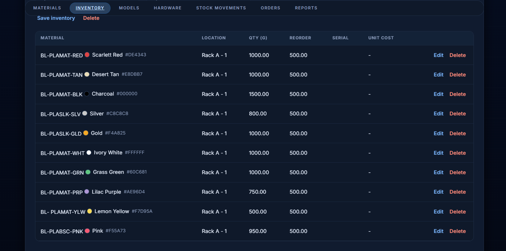
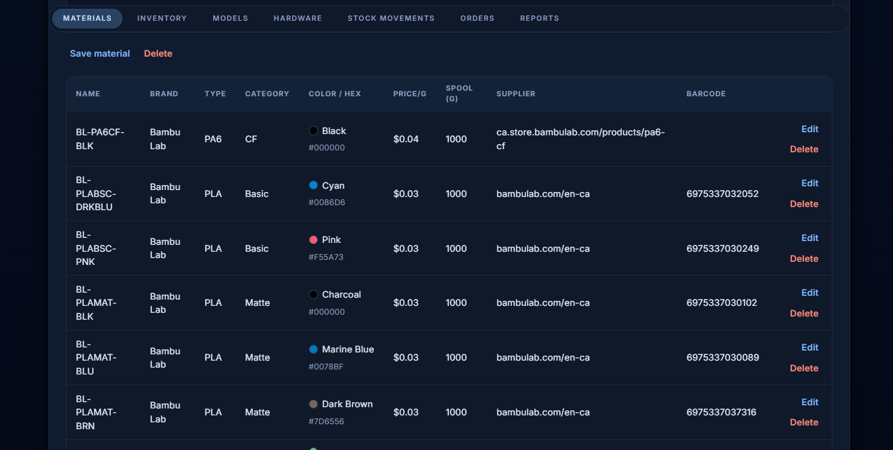
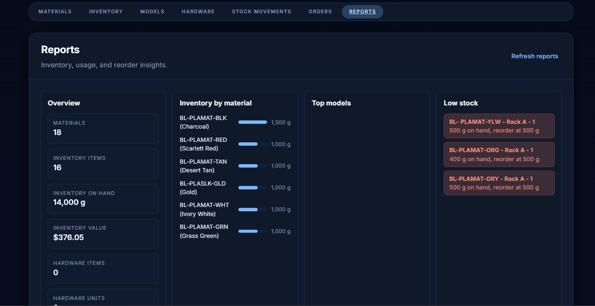

# StockWorks - Everyday User Manual

StockWorks is a simple tool for keeping track of materials in a 3D printing shop. It helps you see what you have, what is running low, and what jobs are coming in from MakerWorks and OrderWorks.

If you can use a web page, you can use StockWorks.

## Quick start
1) Open a web browser.
2) Go to `http://localhost:8000/`
3) The main screen opens right away.

## What StockWorks can do
- **Track filament spools**: color, material, remaining weight.
- **Track hardware**: screws, inserts, magnets, and other parts.
- **Sync merch from MakerWorks**: import merch templates, then keep quantity/catalog updates synced with MakerWorks.
- **Show stock changes**: every add and remove is recorded.
- **Create quotes**: build a material list and price estimate.
- **Show incoming jobs**: live orders from MakerWorks and OrderWorks.

## The main screens (what they mean)
- **Dashboard**: a quick summary of items that need attention.
- **Filament**: all spools and their remaining amounts.
- **Hardware**: all non-filament items and quantities.
- **Movements**: a history of changes so you can see who did what and when.
- **Quotes**: tools for pricing and estimating materials.
- **Orders**: the live job queue from MakerWorks and OrderWorks.

## Barcode scanning on mobile
StockWorks can scan barcodes using your phone or tablet camera.

How it works:
- Open StockWorks on your mobile browser.
- In the Materials or Inventory forms, tap the barcode scan button.
- Grant camera access when prompted.
- Point the camera at the barcode; the value fills in automatically.

Notes:
- Camera scanning requires HTTPS (or localhost).

## Screenshots
These pictures show what the main screens look like.

### Inventory

### Materials

### Reports

## Using the Orders screen (MakerWorks and OrderWorks)
The Orders screen shows the job list so production and inventory stay in sync.

### How StockWorks gets the orders
There are two ways your admin can connect StockWorks:

1) **Direct database link (best option)**
   - StockWorks reads the job list directly from the MakerWorks database.
   - This is automatic once it is connected.
   - The Orders screen fills in on its own.

2) **OrderWorks login (backup option)**
   - If the database connection is not available, StockWorks can log in to OrderWorks.
   - It uses an admin username and password set by your admin.

### What you will see in Orders
- A list of current jobs.
- Each job may include a link to open the same order in OrderWorks.
- If something is missing, you will see a message explaining what is needed.

## Bambu View filament sync (loaded trays)
StockWorks can also read loaded AMS trays from Bambu View so you can quickly see what filament is currently mounted.

Set these variables if you want that integration:
- `BAMBU_VIEW_BASE_URL` (required for Bambu View sync)
- `BAMBU_VIEW_API_KEY` (recommended when Bambu View API auth is enabled)
- `BAMBU_VIEW_API_AUTH_HEADER` (defaults to `X-API-Key`)
- `BAMBU_VIEW_ADMIN_USERNAME` and `BAMBU_VIEW_ADMIN_PASSWORD` (optional fallback if you are not using an API key)

The loaded tray list appears in **Settings > Bambu View**.

## MakerWorks merch sync
If MakerWorks merch has been enabled, open **Hardware** and click **Sync MakerWorks merch**.

What this does:
- Pulls merch templates from MakerWorks `ProductTemplate`.
- Creates or updates matching Hardware records in StockWorks.
- Sets category to `merch` and maps quantity/reorder fields when those columns exist in MakerWorks.
- Writes merch quantity changes (and merch item edits) back to MakerWorks `ProductTemplate` for linked merch items.
- For merch variants (same item/style/color with different sizes), StockWorks writes all sibling variant quantities so MakerWorks size availability stays accurate (e.g., only `L` in stock means other sizes are sold out).
- New merch created in StockWorks is also created in MakerWorks `ProductTemplate` automatically (catalog image remains unset until added in MakerWorks).

You can manage merch directly in the **Merch** tab (add, edit, delete) and use the dedicated inventory search bar.
Merch records support variant details such as category, color, size, style, and SKU.

## Simple tips
- Use Dashboard first if you only have a minute.
- Use Movements to answer "what changed today?"
- Use Quotes to quickly estimate material needs.

## For your admin (short, plain notes)
If you set up StockWorks:
- Open the app at `http://localhost:8000/`
- Data is stored in `stockworks/data/`
- Orders integration needs either:
  - A MakerWorks database link, or
  - OrderWorks login details and the OrderWorks web address

